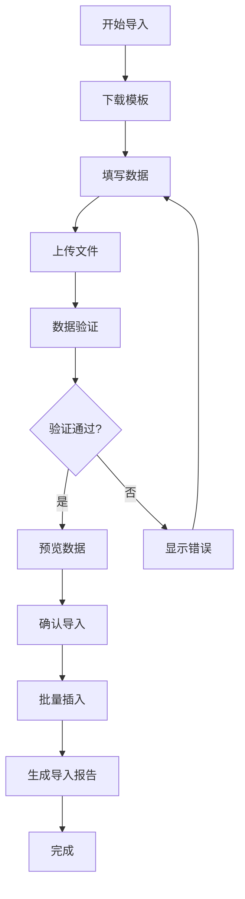

# 批量导入用户功能详细指南

## 概述

批量导入功能允许超级管理员通过Excel文件一次性导入大量教师或学生用户。系统会自动处理数据验证、去重和错误处理。

## 导入流程



## Excel模板格式

### 统一用户导入模板

系统现在支持直接导入Excel文件（.xlsx, .xls格式），无需转换为CSV。推荐使用系统提供的模板文件进行数据填写。

**模板字段说明**:

| 字段名 | 数据类型 | 必填 | 说明 | 示例 |
|--------|----------|------|------|------|
| 用户名 | 文本 | 是 | 用户名，唯一，3-50字符 | teacher_zhang |
| 角色 | 文本 | 是 | 用户角色：teacher/教师, student/学生, super_admin/超级管理员 | teacher |
| 学号/工号 | 文本 | 否 | 学生学号或教师工号 | T2024001 或 2021001 |
| 姓名 | 文本 | 是 | 用户真实姓名 | 张老师 |
| 邮箱 | 文本 | 是 | 邮箱地址 | zhang@example.com |
| 状态 | 文本 | 否 | 用户状态：active(启用), inactive(停用) | active |

**示例数据行**:

| 用户名 | 角色 | 学号/工号 | 姓名 | 邮箱 | 状态 |
|--------|------|-----------|------|------|------|
| teacher_zhang | teacher | T2024001 | 张老师 | zhang@example.com | active |
| student_li | student | 2021001 | 李同学 | li@example.com | active |
| admin_wang | super_admin | ADMIN001 | 王管理员 | wang@example.com | active |

### 文件格式支持
- **Excel格式**: `.xlsx` (推荐), `.xls`
- **CSV格式**: `.csv` (兼容原有格式)
- **文件大小**: 最大支持 10MB
- **编码**: UTF-8 (推荐)

## 数据验证规则

### 通用验证规则

1. **必填字段检查**
   - 用户名、学号/工号、姓名必须填写
   - 缺失必填字段会标记为错误

2. **唯一性检查**
   - 用户名必须唯一
   - 学号/工号必须唯一
   - 重复数据会标记为错误

3. **格式验证**
   - 用户名：3-50字符，只能包含字母、数字、下划线
   - 邮箱：有效邮箱格式（如果提供）
   - 手机号：11位数字（如果提供）

### 特定验证规则

#### 教师数据
- 工号必须以 "T" 开头，后跟数字
- 院系名称必须在系统院系列表中

#### 学生数据
- 学号必须是纯数字或特定格式
- 年级格式验证（如：2021级）
- 班级名称必须存在

## 后端处理逻辑

### 1. 文件上传处理

```javascript
// 伪代码示例
async function handleFileUpload(file, importType) {
    try {
        // 1. 验证文件类型和大小
        if (!isValidExcelFile(file)) {
            throw new Error('文件格式不支持');
        }
        
        // 2. 解析Excel数据
        const data = await parseExcelFile(file);
        
        // 3. 数据验证
        const validationResult = validateImportData(data, importType);
        
        // 4. 返回预览结果
        return {
            valid: validationResult.valid,
            validRecords: validationResult.validRecords,
            invalidRecords: validationResult.invalidRecords,
            batchId: generateBatchId()
        };
        
    } catch (error) {
        throw new Error(`文件处理失败: ${error.message}`);
    }
}
```

### 2. 数据验证函数

```javascript
function validateImportData(data, importType) {
    const validRecords = [];
    const invalidRecords = [];
    
    for (const record of data) {
        const errors = [];
        
        // 必填字段检查
        if (!record.username) errors.push('用户名不能为空');
        if (!record.user_number) errors.push('学号/工号不能为空');
        if (!record.full_name) errors.push('姓名不能为空');
        
        // 格式验证
        if (record.username && !isValidUsername(record.username)) {
            errors.push('用户名格式不正确');
        }
        
        if (record.email && !isValidEmail(record.email)) {
            errors.push('邮箱格式不正确');
        }
        
        // 唯一性检查（异步，需要数据库查询）
        if (record.username && await isUsernameExists(record.username)) {
            errors.push('用户名已存在');
        }
        
        if (record.user_number && await isUserNumberExists(record.user_number)) {
            errors.push('学号/工号已存在');
        }
        
        // 特定类型验证
        if (importType === 'teachers') {
            if (!isValidTeacherNumber(record.user_number)) {
                errors.push('教师工号格式不正确');
            }
        } else if (importType === 'students') {
            if (!record.grade) errors.push('年级不能为空');
            if (!record.class_name) errors.push('班级不能为空');
        }
        
        if (errors.length === 0) {
            validRecords.push(record);
        } else {
            invalidRecords.push({
                record: record,
                errors: errors
            });
        }
    }
    
    return { validRecords, invalidRecords };
}
```

### 3. 批量导入处理

```javascript
async function batchImportUsers(batchId, importType, userId) {
    const batch = await getBatch(batchId);
    
    try {
        // 开始导入
        await updateBatchStatus(batchId, 'processing');
        
        let successCount = 0;
        let failedCount = 0;
        
        // 批量插入用户数据
        for (const record of batch.validRecords) {
            try {
                await createUser({
                    ...record,
                    role: importType === 'teachers' ? 'teacher' : 'student',
                    password: 'default123', // 默认密码
                    status: 'active',
                    createdBy: userId
                });
                
                successCount++;
                
            } catch (error) {
                failedCount++;
                
                // 记录失败信息
                await recordImportFailure(batchId, record, error.message);
            }
        }
        
        // 更新导入结果
        await updateBatchResult(batchId, successCount, failedCount);
        
        return {
            successCount,
            failedCount,
            batchId
        };
        
    } catch (error) {
        await updateBatchStatus(batchId, 'failed');
        throw error;
    }
}
```

## 错误处理机制

### 1. 文件级别错误
- **文件格式错误**: 只支持 .xlsx 和 .xls 格式
- **文件大小超限**: 最大支持 10MB
- **文件损坏**: 无法解析的Excel文件

### 2. 数据级别错误
- **必填字段缺失**: 标记具体缺失字段
- **格式错误**: 提供具体错误描述
- **重复数据**: 标识重复的记录

### 3. 系统级别错误
- **数据库连接失败**: 重试机制
- **权限不足**: 检查用户权限
- **系统资源不足**: 限制并发导入

## 性能优化策略

### 1. 分批处理
```javascript
// 大数据量分批处理
const BATCH_SIZE = 100;

async function batchInsertUsers(users) {
    const batches = [];
    
    for (let i = 0; i < users.length; i += BATCH_SIZE) {
        batches.push(users.slice(i, i + BATCH_SIZE));
    }
    
    for (const batch of batches) {
        await insertUsersBatch(batch);
    }
}
```

### 2. 异步处理
- 使用消息队列处理大量导入
- 提供导入进度查询接口
- 支持导入任务取消

### 3. 缓存优化
- 缓存院系、班级等基础数据
- 使用Redis缓存验证结果
- 数据库连接池优化

## 安全考虑

### 1. 文件安全
- 扫描上传文件的安全性
- 限制文件类型和大小
- 防止恶意文件上传

### 2. 数据安全
- 敏感信息加密存储
- 导入日志记录
- 操作权限验证

### 3. 系统安全
- 防止SQL注入
- 限制并发导入数量
- 异常情况自动回滚

## 导入结果报告

### 成功导入报告
```json
{
    "batch_id": "uuid",
    "import_type": "teachers|students",
    "total_records": 100,
    "success_count": 95,
    "failed_count": 5,
    "status": "completed",
    "completed_at": "2024-01-12T10:00:00Z",
    "failed_records": [
        {
            "row_number": 3,
            "data": {"username": "test", ...},
            "error": "用户名已存在"
        }
    ]
}
```

### 下载失败报告
用户可以选择下载包含错误详细信息的Excel文件，便于修正后重新导入。

## 最佳实践

### 1. 模板使用建议
- 下载最新模板文件
- 严格按照模板格式填写
- 避免使用特殊字符
- 先小批量测试导入

### 2. 数据准备建议
- 提前去重数据
- 验证数据格式
- 分批导入大数据量
- 准备备用导入方案

### 3. 监控和维护
- 定期清理导入历史
- 监控导入性能
- 更新验证规则
- 备份重要数据

## 故障排除

### 常见问题及解决方案

1. **导入速度慢**
   - 减少单次导入数据量
   - 检查网络连接
   - 优化数据库配置

2. **内存溢出**
   - 分批处理大数据
   - 增加服务器内存
   - 优化数据处理逻辑

3. **数据重复**
   - 使用模板去重功能
   - 导入前检查数据
   - 使用唯一性约束

4. **格式错误**
   - 下载最新模板
   - 严格按照格式填写
   - 使用数据验证工具

---

**文档版本**: v1.0  
**最后更新**: 2024-01-12  
**维护者**: 超级管理平台开发团队